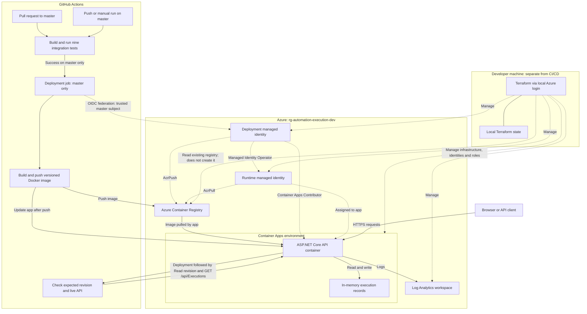

# Automation Execution API

An ASP.NET Core API for managing test-execution records, containerised with Docker and deployed to Azure Container Apps using Terraform and GitHub Actions.

This project demonstrates API development, automated integration testing, infrastructure as code, passwordless deployment authentication, and continuous delivery to a live HTTPS endpoint.

> **Current scope:** this is a learning/portfolio API that stores execution records. It does **not** execute Playwright tests or connect to the WPF Automation Console yet. Records and statuses are sample/client-supplied data, not independently verified test results.

## Project status

- CRUD endpoints for execution records, with separate create/update DTOs.
- Nine xUnit integration tests using `WebApplicationFactory<Program>`.
- Multi-stage Docker build targeting .NET 8.
- Azure Container Registry (ACR) and Azure Container Apps deployment.
- Terraform-managed application infrastructure and deployment identity.
- GitHub Actions: PR validation, image build/push, deployment and smoke verification.
- Successful deployment demonstrated during development; ongoing availability is not guaranteed.
- Screenshot evidence is still to be added in the marked sections below.

Inspired by the CoderCo Azure project brief, using a custom ASP.NET application rather than the example application. Azure Front Door/Application Gateway and a custom domain are deliberately deferred to limit cost. This is not a claim of completing every original assignment requirement or receiving CoderCo accreditation.

## Technology stack

| Area | Technology |
|---|---|
| API | C#, ASP.NET Core, .NET 8 |
| API exploration | Swagger / OpenAPI, enabled in Development only |
| Automated tests | xUnit, Microsoft.AspNetCore.Mvc.Testing |
| Containers | Docker multi-stage build |
| Registry and hosting | Azure Container Registry Basic, Azure Container Apps |
| Infrastructure | Terraform, AzureRM provider |
| CI/CD | GitHub Actions |
| Deployment authentication | Microsoft Entra workload identity federation (OIDC) |
| Runtime image access | User-assigned managed identity with AcrPull |
| Logging | Azure Log Analytics |

## Architecture and responsibilities

| Component | Responsibility and connection |
|---|---|
| GitHub pull request | Starts the build-and-test job; deployment is skipped. |
| GitHub master run | Runs tests, then builds an image, pushes to ACR and updates the Container App. |
| Deployment identity | Trusts the configured GitHub master subject and supplies scoped Azure access. |
| ACR | Stores the initial image and versioned pipeline images. |
| Container App | Pulls its image using its separate runtime identity and serves the API over HTTPS. |
| Log Analytics | Receives configured application/platform logging. |
| Terraform on the developer machine | Manages infrastructure using local state; it is not run by the deployment workflow. |
| In-memory list inside the API | Holds execution records; there is no database or worker. |

Terraform owns infrastructure settings. GitHub Actions owns subsequent container-image releases. A narrowly scoped `ignore_changes` rule prevents Terraform from reverting the image to the initial `v1` image during updates. Recreating the app still requires that initial image to exist.

### Current architecture

GitHub renders the following Mermaid diagram directly; no separate image file is required. Solid arrows show delivery/runtime connections. Dotted arrows show identity, permissions or infrastructure management.



The resource group and registry were created manually. Terraform manages the application infrastructure and access configuration; the deployment workflow manages subsequent image updates. The verification step runs on GitHub, not inside the API. Pull requests stop after CI and never enter the deployment path. WPF integration, a database, a test worker and Front Door are future work and are intentionally absent from this diagram.

## Repository layout

```text
AutomationExecution.API/
  Controllers/             HTTP endpoint implementations
  Dtos/                    Request contracts
  Models/                  Execution record model
  Properties/              Local launch profiles
  Program.cs               API startup and test-host entry point
  Dockerfile               Multi-stage build
  .dockerignore            Exclusions for the API Docker build context
AutomationExecution.API.Tests/
  ExecutionsApiTests.cs     Integration tests and test-data helpers
terraform/
  providers.tf             Terraform/provider configuration
  variables.tf             Infrastructure inputs
  main.tf                  Application infrastructure
  github-actions.tf        Deployment identity, federation and roles
  outputs.tf               Application URL and identity outputs
  .terraform.lock.hcl       Provider dependency lock file
.github/workflows/
  api-ci.yml               Build, test and deployment workflow
docs/screenshots/          Add the evidence images described below
AutomationExecution.API.sln
```

## Run locally

Prerequisites: Git and a .NET 8 SDK. Docker Desktop is needed for container commands; Azure CLI and Terraform are needed only for infrastructure work.

Run these PowerShell commands from a suitable parent folder:

```powershell
# Download the repository and enter its root folder.
git clone https://github.com/abdishakurhussein/automation-execution-api.git
cd automation-execution-api

# Restore packages and start the API with its local Development HTTP profile.
dotnet restore AutomationExecution.API.sln
dotnet run --project AutomationExecution.API/AutomationExecution.API.csproj --launch-profile http
```

Open `http://localhost:5034/swagger` to explore the endpoints. Use a second terminal for requests while the application is running. Press Ctrl+C in the application terminal to stop it.

Swagger is a development interface for calling the API. It is not a test runner and is not enabled by the default production deployment. A 404 at `/swagger` or `/` in Azure does not itself mean the API is broken; use `/api/Executions`.

## API endpoints

| Method | Path | Behaviour | Successful response |
|---|---|---|---|
| GET | `/api/Executions` | List execution records | 200 and JSON array |
| GET | `/api/Executions/{id}` | Retrieve a record | 200; 404 if missing |
| POST | `/api/Executions` | Create a record; server assigns ID | 201 and Location header |
| PUT | `/api/Executions/{id}` | Update a record | 200; 404 if missing |
| DELETE | `/api/Executions/{id}` | Delete a record | 204; 404 if missing |

Example local request:

```powershell
# Read records from your local API.
Invoke-RestMethod -Uri "http://localhost:5034/api/Executions"

# Prepare a sample execution record. This does not launch a test suite.
$request = @{
    testSuite   = "Example regression suite"
    environment = "TEST"
    status      = "Running"
    startedAt   = [DateTime]::UtcNow.ToString("o")
    completedAt = $null
} | ConvertTo-Json

# Create the record locally; do not submit sensitive data to this demo.
Invoke-RestMethod -Method Post -Uri "http://localhost:5034/api/Executions" -ContentType "application/json" -Body $request
```

The stable development endpoint is:

[GET /api/Executions](https://ca-automation-execution-dev.lemonmoss-7f8c01f1.uksouth.azurecontainerapps.io/api/Executions)

The endpoint may be unavailable if resources are removed to control costs. The app can scale to zero, so its first request after inactivity may take longer.

## Automated tests

From the repository root:

```powershell
# Build and run the solution's integration tests in Release configuration.
dotnet test AutomationExecution.API.sln --configuration Release

# Optional: show individual test results in more detailed console output.
dotnet test AutomationExecution.API.sln --configuration Release --logger "console;verbosity=normal"
```

Current coverage comprises nine scenarios:

1. List executions and find the record created by the test.
2. Retrieve an existing execution.
3. Return 404 for an unknown execution.
4. Create a valid execution and check the returned record and Location header.
5. Reject an invalid create request with 400.
6. Update an existing execution.
7. Return 404 when updating an unknown execution.
8. Delete an execution and confirm it can no longer be retrieved.
9. Return 404 when deleting an unknown execution.

The tests start an in-process ASP.NET test host. They do not call the live Azure endpoint, require a running Docker container, or run the separate TypeScript/Playwright project. Successful local output has shown nine passed tests. A green build without a test summary is not evidence that tests ran.

The HTTP test host can emit `Failed to determine the https port for redirect`. This warning has appeared alongside passing tests; the HTTPS test-host configuration remains a cleanup item.

## Run with Docker

Start Docker Desktop, then run from the repository root:

```powershell
# Use the nested API directory as the build context expected by the Dockerfile.
docker build --tag automation-execution-api:local --file AutomationExecution.API/Dockerfile AutomationExecution.API

# Expose the container's HTTP port on local port 8080; bind only to localhost.
docker run --rm --name automation-execution-api-local -p 127.0.0.1:8080:8080 -e ASPNETCORE_HTTP_PORTS=8080 automation-execution-api:local
```

In another terminal, request `http://localhost:8080/api/Executions`. The default container environment does not enable Swagger. Stopping the container loses its in-memory records.

## Azure infrastructure and bootstrap requirements

Current names are project-specific, not a generic one-command deployment template:

| Resource | Name |
|---|---|
| Existing resource group | `rg-automation-execution-dev` |
| Existing Basic registry | `abdiautomationregistry` |
| Container Apps environment | `cae-automation-execution-dev` |
| Container App | `ca-automation-execution-dev` |
| Log Analytics workspace | `log-automation-execution-dev` |
| Runtime identity | `id-automation-execution-dev` |
| Deployment identity | `id-github-automation-execution-dev` |

The resource group and registry were created manually and are referenced as Terraform data sources. Terraform manages the environment, workspace, app, two identities, federation and associated role assignments. The application uses 0.25 CPU, 0.5 GiB memory, minimum zero replicas and maximum one replica, with HTTPS ingress targeting container port 8080.

Before deploying into a new subscription:

1. Review costs and select the intended subscription.
2. Create the resource group and a globally unique registry name; update configuration and workflow names accordingly.
3. Register the required resource providers, including Microsoft.App and Microsoft.OperationalInsights, and ensure your account can create managed identities and role assignments.
4. Build and push `automation-execution-api:v1` to that registry before the first Container App creation.
5. Create an ignored `terraform/terraform.tfvars` containing `subscription_id = "YOUR_SUBSCRIPTION_ID"` and any name overrides.
6. Configure the federated subject for your own repository. Do not reuse this repository's numeric owner/repository IDs.
7. Run the commands below and review the plan before approving an apply.

```powershell
# Authenticate locally for Terraform infrastructure administration.
az login
cd terraform

# Initialise using the committed provider lock file and validate configuration.
terraform init
terraform fmt -check
terraform validate
terraform plan

# Creates/updates billable Azure resources; inspect the plan before confirming.
terraform apply
```

State is local and must be kept securely backed up. Do not commit state, saved plans, credentials, `.terraform/`, or local variable files. A shared remote-state backend and reusable infrastructure modules are not implemented yet. Do not start from empty state against existing resources and assume Terraform will automatically adopt them.

## CI/CD workflow

The workflow is defined in [.github/workflows/api-ci.yml](.github/workflows/api-ci.yml).

| Trigger | Tests | Deployment |
|---|---|---|
| PR opened/updated against master | Run | Skipped intentionally |
| Push/merge to master | Run | Runs only after tests pass |
| Manual run on master | Run | Runs only after tests pass |
| Manual run on another branch | Run | Skipped |
| Ordinary feature-branch push without a PR | No matching push trigger | No deployment |

Build-and-test restores packages, builds Release configuration and runs the solution tests. The deployment job checks out the same run's source, logs into Azure with OIDC, builds on the GitHub runner, pushes to ACR, then updates the existing Container App.

Image tags contain the commit SHA, workflow run ID and run attempt. These are distinct release references, not enforced immutable registry tags. Verification checks that the latest revision is ready and references the expected image, then sends a read-only request to `/api/Executions` and checks for a JSON array. This is a smoke check, not full production end-to-end coverage.

Concurrency is grouped by Git ref with cancellation disabled. Pending runs can be superseded under GitHub concurrency behaviour; the workflow is not a guarantee that every intermediate commit is deployed. Failed post-deployment checks mark the run as failed but do not automatically roll back the app.

### GitHub configuration

Create these under **Settings → Secrets and variables → Actions → Variables → Repository variables**:

| Variable | Value source |
|---|---|
| `AZURE_CLIENT_ID` | `terraform output -raw github_actions_client_id` |
| `AZURE_TENANT_ID` | `terraform output -raw github_actions_tenant_id` |
| `AZURE_SUBSCRIPTION_ID` | The subscription used for these resources |

These are identifiers, not client passwords. The workflow uses `vars.*`, not `secrets.*`. Authentication additionally requires the configured federation and the deployment job's `id-token: write` permission. No long-lived client secret or ACR admin password is configured.

The deployment identity has AcrPush scoped to the registry, Container Apps Contributor scoped to the app, and Managed Identity Operator scoped to the runtime identity. The runtime identity separately has AcrPull on the registry. The app itself has no application-user authentication yet; passwordless deployment authentication does not secure API access.

### Troubleshooting example: OIDC subject mismatch

The initial deployment failed with `AADSTS700213` because the trusted subject omitted the numeric owner/repository identifiers included in GitHub's actual assertion. Terraform was corrected to match the exact subject reported by the login error, retaining the master-branch restriction. Applying the fix and rerunning the failed job produced a successful deployment.

For a different repository, inspect the actual subject and compare subject, issuer and audience. Do not solve this by broadening trust or adding subscription-wide permissions. Adding a GitHub environment can change the subject and requires a corresponding trust update. Your local `az login` session is not used by the hosted GitHub runner.

## Screenshot evidence — add your captures here

Create `docs/screenshots/` in the repository root. Save the PNG files with the exact names below. Each image line is commented out to avoid broken images until a real capture is available. After saving a screenshot, remove the surrounding `<!--` and `-->` lines to display it on GitHub.

Crop to the relevant panel. Do not include passwords, tokens, payment details, private account information or unrelated browser tabs. Review logs and JSON before publishing. Subscription and tenant IDs are identifiers rather than passwords, but can be cropped out when unnecessary. Do not fabricate screenshots or describe a local Swagger view as the production UI.

### 1. Successful Azure deployment


### 2. All nine tests passing


### 3. Live HTTPS API response


### 4. Azure resources


### 5. Versioned container images


### 6. Pull-request deployment protection


### 7. Local Swagger (optional)


## Costs and safe cleanup

This is not a guaranteed free deployment. Registry provisioned time, application usage, logs and applicable network usage can incur charges; credits and free allowances depend on the account and their expiry. Closing your laptop or stopping local Docker does not remove Azure resources. Check Azure Cost Management at subscription/resource-group scope. Budget alerts warn about spending but are not a spending cap.

Before teardown, capture evidence, back up Terraform state securely, preserve any required images/data, and prevent the deployment workflow from running against missing infrastructure. Review the exact resources and dependencies before approving deletion.

`terraform plan -destroy` previews deletion of Terraform-managed resources; do not apply a destroy plan unless removal is intended. The manually created ACR and resource group are data sources and will remain after Terraform-managed resources are destroyed. They require separate reviewed cleanup. Do not delete a resource group without confirming it contains no unrelated work. Deleted images/logs and in-memory records may not be recoverable.

Recreation requires restoring the bootstrap resource group, registry and initial image as well as the infrastructure and GitHub configuration. Keeping source code alone is not a backup of state, logs or container images.

## Limitations and next phase

- Static in-memory storage is not durable or concurrency-safe; IDs and records are not reliable across restarts or multiple instances.
- Public CRUD endpoints have no configured authentication/role-based application access. Use synthetic data only; do not expose sensitive information or real test-execution capabilities through this design.
- No queue, worker, Playwright execution, WPF integration, database, automated rollback or dedicated health endpoint exists yet.
- Terraform is stored in a flat configuration with local state; remote-state collaboration and module refactoring remain future work.
- Front Door/Application Gateway and a custom domain are omitted deliberately. Built-in Container Apps HTTPS is used instead.
- CI currently reports tests in job logs; it does not publish a separate test-report artifact or enforce a coverage threshold.
- .NET, action and provider dependencies require ongoing support/security review; a green pipeline is not a production-readiness certification.

The next platform milestone is connecting the WPF Automation Console to this API to display execution records. Later work will add persistence, authentication, authorised queued execution through a separate worker, and real Playwright results. The existing TypeScript test suites remain separate from the nine API integration tests described here.
