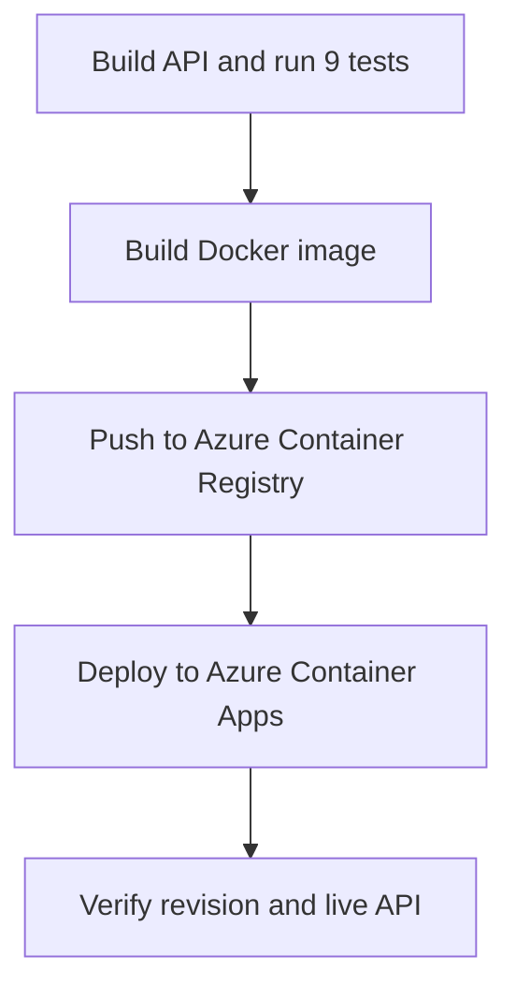
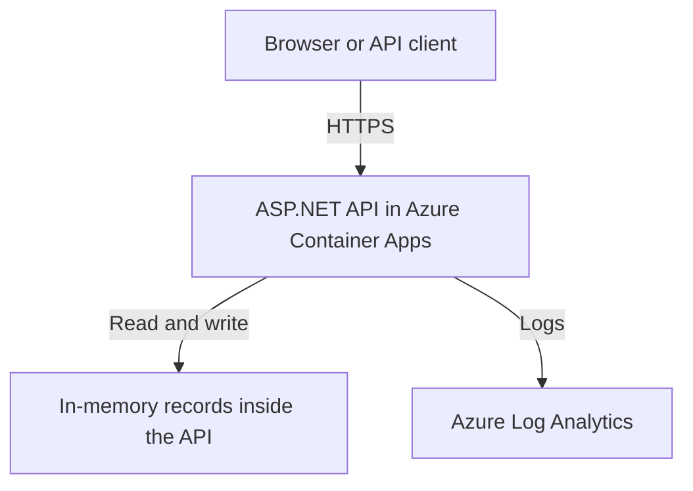
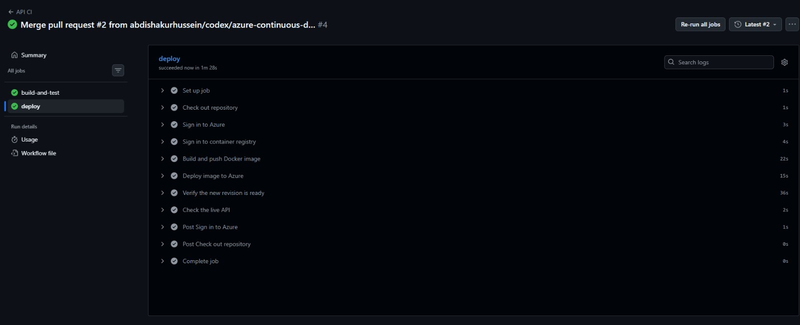
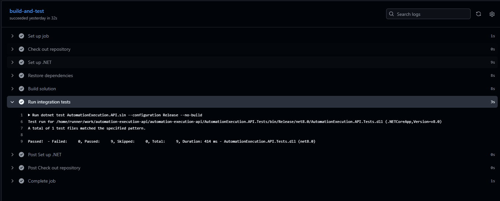
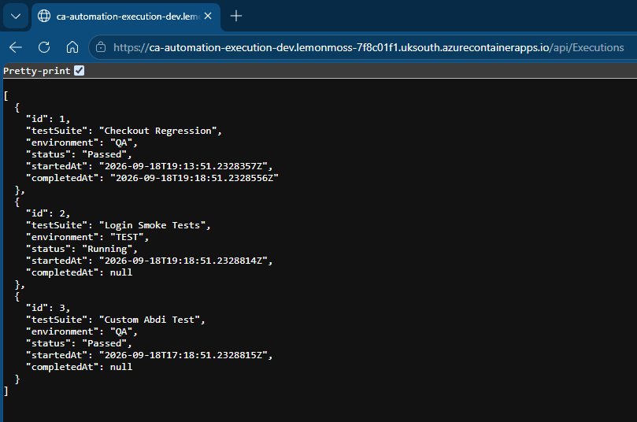
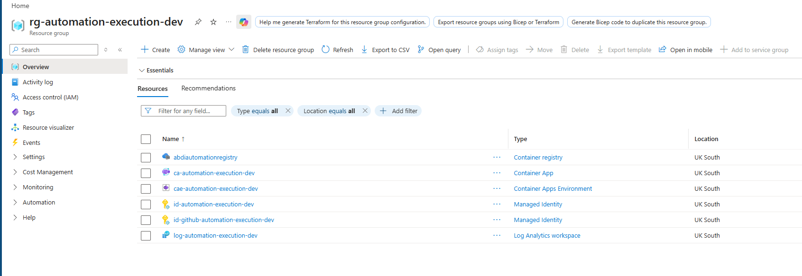
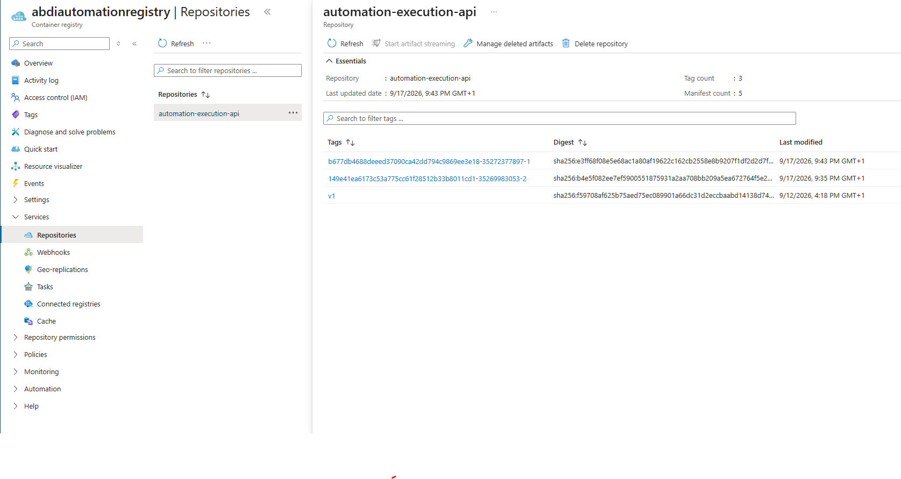
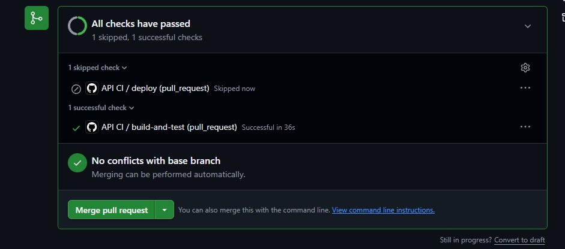
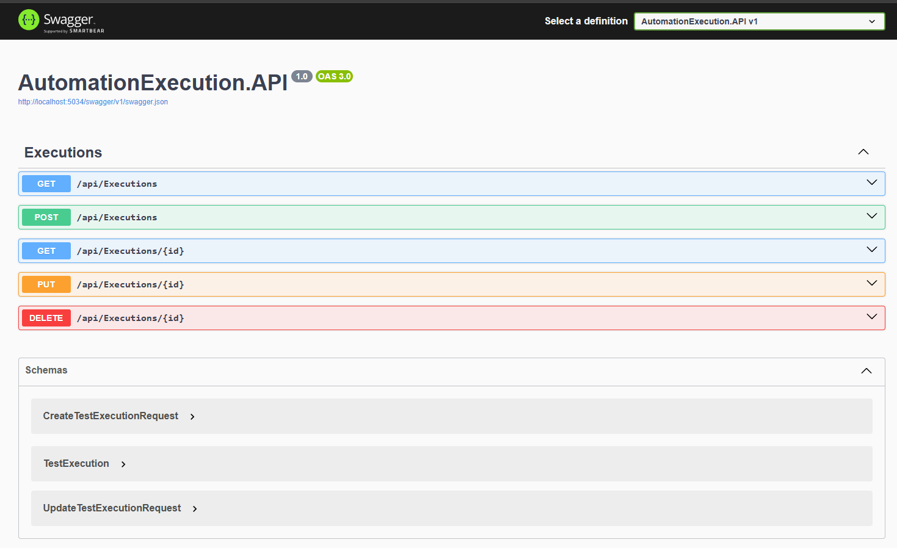

# Automation Execution API

A .NET 8 API for managing test-execution records, tested with xUnit and deployed to Azure using Docker, Terraform and GitHub Actions.

> This learning project stores sample records. It does not run Playwright tests or connect to the WPF console yet.

[Live API](https://ca-automation-execution-dev.lemonmoss-7f8c01f1.uksouth.azurecontainerapps.io/api/Executions) · [GitHub Actions](https://github.com/abdishakurhussein/automation-execution-api/actions)

## Architecture

### Delivery pipeline

Pull requests run tests only. A merge to `master` triggers the complete pipeline:



### Running application



| Responsibility | Owner |
|---|---|
| Infrastructure and permissions | Terraform, run locally |
| Image builds and releases | GitHub Actions |
| Passwordless deployment login | Dedicated Azure identity with OIDC trust |
| Pulling images from the registry | Separate runtime identity with AcrPull |

## Run locally

Requires Git and the .NET 8 SDK. Run in PowerShell:

```powershell
# Clone the project and enter the repository.
git clone https://github.com/abdishakurhussein/automation-execution-api.git
cd automation-execution-api

# Start in Development mode; Docker is not required.
dotnet run --project AutomationExecution.API/AutomationExecution.API.csproj --launch-profile http
```

Open **http://localhost:5034/swagger**. Stop with **Ctrl+C**.

Swagger is enabled in Development only. The Azure deployment returns JSON at `/api/Executions`, not a Swagger page.

## API endpoints

| Method | Endpoint | Purpose |
|---|---|---|
| GET | `/api/Executions` | List records |
| GET | `/api/Executions/{id}` | Retrieve a record |
| POST | `/api/Executions` | Create a record; returns 201 and its location |
| PUT | `/api/Executions/{id}` | Update a record |
| DELETE | `/api/Executions/{id}` | Delete a record; returns 204 |

Unknown IDs return 404. Create/update requests use DTOs; the server assigns IDs.

## Run tests

From the repository root:

```powershell
# Build and run the integration tests in Release configuration.
dotnet test AutomationExecution.API.sln --configuration Release
```

The **nine xUnit tests** cover CRUD operations, invalid input and missing records. They use an in-process API through `WebApplicationFactory`, not the live Azure API or the separate Playwright project.

## Run with Docker

Start Docker Desktop, then run from the repository root:

```powershell
# Build using the nested API folder as the Docker build context.
docker build --tag automation-execution-api:local --file AutomationExecution.API/Dockerfile AutomationExecution.API

# Publish the container port to localhost only.
docker run --rm --name automation-execution-api-local -p 127.0.0.1:8080:8080 -e ASPNETCORE_HTTP_PORTS=8080 automation-execution-api:local
```

Open **http://localhost:8080/api/Executions**. Swagger is disabled in this default container configuration.

## CI/CD

Workflow: [.github/workflows/api-ci.yml](.github/workflows/api-ci.yml)

| Event | Result |
|---|---|
| Pull request into `master` | Build and test; deployment skipped |
| Push/merge to `master` | Build, test and deploy |
| Manual run on `master` | Build, test and deploy |
| Manual run on another branch | Build and test only |

Deployment requires passing tests. Image tags include the commit SHA, run ID and attempt. The workflow checks that the expected image's revision is ready, then verifies the live API returns a JSON array. Failed checks do not automatically roll back a deployment.

Add these **repository variables** under GitHub **Settings → Secrets and variables → Actions → Variables**:

- `AZURE_CLIENT_ID`
- `AZURE_TENANT_ID`
- `AZURE_SUBSCRIPTION_ID`

Authentication uses OIDC, not a stored client password. Azure's federated subject must exactly match GitHub's token subject for the repository and `master`. The initial subject mismatch was corrected through Terraform and verified by a successful deployment.

## Terraform and Azure

[terraform/](terraform/) manages the Container App, hosting environment, logging workspace, identities and permissions. The resource group and registry were created manually and are referenced as existing resources.

For a fresh deployment, first create those resources, push the initial `automation-execution-api:v1` image, and adapt the subscription, names and repository-specific OIDC trust. Azure CLI, Terraform and permission to create role assignments are required.

```powershell
# Authenticate for local infrastructure administration.
az login
cd terraform

# Initialise and preview changes before creating billable resources.
terraform init
terraform validate
terraform plan
```

Supply `subscription_id` in an ignored `terraform.tfvars` file. Run `terraform apply` only after reviewing the plan. State is local: back it up securely and never commit state, saved plans or credentials. GitHub owns subsequent image updates; Terraform ignores that specific field after creation.

## Screenshots

### Successful CI/CD deployment



### Nine integration tests passing



### Live HTTPS API response



### Azure resources



### Versioned container images



### Pull-request checks



### Local Swagger



## Limitations and costs

- Records are held in a static list: they reset on restart and are not concurrency-safe.
- The public API has **no application authentication**. Use synthetic data only. OIDC secures deployment, not API access.
- No database, test worker, WPF integration or automatic rollback is implemented yet.
- Azure resources can incur charges even when no workflow runs. Monitor spending and credit expiry; budget alerts do not stop charges.
- Before cleanup, preserve evidence/state and prevent deployment runs. `terraform destroy` does **not** remove the manually created registry or resource group; review those separately.
- Inspired by the CoderCo Azure brief. Front Door/Application Gateway and a custom domain are deferred to limit cost; not every original requirement is implemented.

## Next milestone

Connect WPF to display API records, then add persistence, authentication and a separate worker for real Playwright execution.
